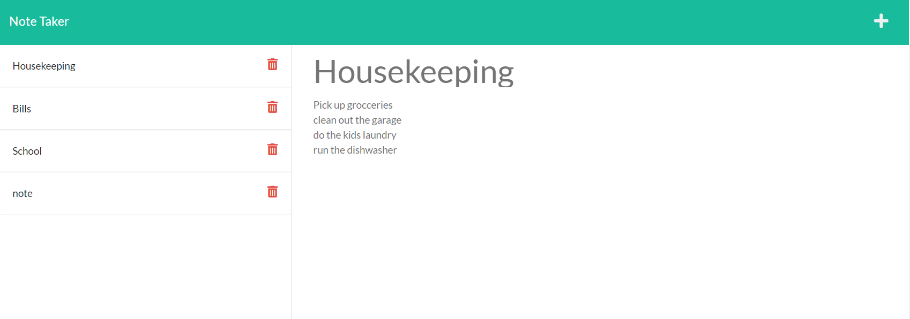

# Note-Taker-Express, Inc,

## Purpose
Keep track of your life in real-time!  This app connects to a server and allows you to save your notes unto the world wide web!  Currently you can save and read notes, coming soon, the ability to delete notes!

Keep your life organized, it's fast and easy, give it a try!

## Installation
* Git clone repository from 
* Open terminal to download node-module Express.js "npm i express"

## Built With
* HTML 
* CSS
* JS
* Node.js
* JSON
* Express.js
* HEROKU

## Website
* https://whispering-mesa-27839.herokuapp.com/

## Contributing
Open to all contributions

## Questions
Feel free to reach out GitHub or email if you have any questions

## GitHub URL
* 

## Email
* SBanuelos1234@gmail.com

Made with ❤️ by Salvador Banuelos
### © 2022 Note-Taker-Express, Inc.
